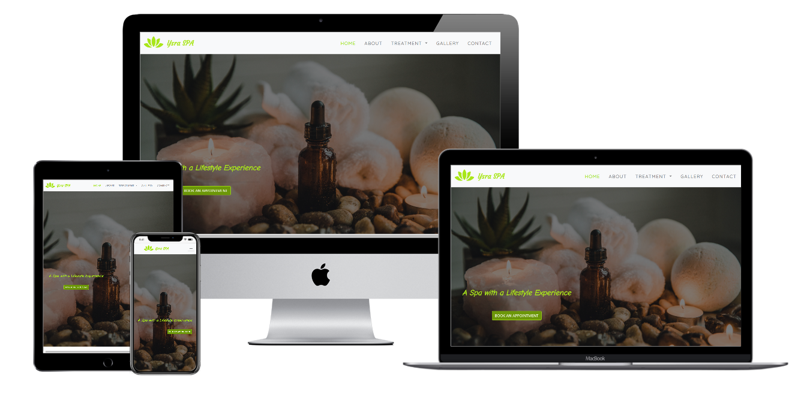

## User Centric Frontend Development Milestone Project

Ysra Spa is a service website for my first milestone project. This project is to show what I have learn from the three module HTML, CSS and User Centric fronted.

Live site click [Here](https://saharalnoor.github.io/ysra-spa-milestone-project-1/)

## Goal of the Website

Providing quality content of the website that is appeling to our ideal clients and users.

## UX

This website  is design to allow the the users to 

## User Story

- As a user I want to use a user-friendly website.
- As a user I want a easy to navigate and not complicated website.
- As a user I want to use a relevant content website.
- As a user I want to make secure the confidentiality of my details.
- As a user I want to be able to book an appointment online easily.
- As a usr I want to be able to use a fast website.

## Wireframes Mockups

* [Wireframe-Mobile](wireframeMockups/wireframe-mobile/wireframes-mobile.pdf)
* [Wireframe-Tablet](wireframeMockups/wireframe-tablet/wireframes-tablets.pdf)
* [Wireframe-Desktop](wireframeMockups/wireframe-desktop/wireframe-desktops.pdf)

## Features

This website has multiple page which consist of Home, About, Treatment with two sub-pages Facial, Hand and Foot. It has Galley and Contact.

- [Home](index.html) - It is the landing page, where the potential clients can book an appoinment and there is a intial treatment section.
- [About](about.html) - Information about the establishment, tips and etiquette section
- [Treatment (Body Treatment)](treatments.html) - Body treatment one of the services that the spa´s offering, here you will see the description and time of this services.
    - [Facial Treatment](facial-treatment.html) - sub page of treatment. Facial treatment offering the facial services.
    - [Hand and Foot Treatmen](hand-and-foot-treatment.html) - the last sub-page. Hand and Foot Treatment, it has four different services.
- [Gallery](gallery.html) - where the users will see the clients experiences and spa facilities
- [Contact](contact.html) - A form that allows the users to contact the establishment , and where the details is written.

## Implemented Features

- Responsive navigation Bar on each pages
- Hero-image on each pages
- Footer with social icons and copyright information
- Modal button for booking appointment
- Clickable images on home page which will direct to the respective treatments
- Contact Form
- Gallery Page that are clickable for full view

## About the site

The site has a simple theme that has white background. The colors that has been used are:

- #a8e619 (Green-yellow) : It was used as the primary color
- #6c9708 (Olivedrab) : It was used for button background color.
- #909488 (Gray) : It was used for body footer text and navigation bar items.
- #466106 (Darkolivegreen) : It was used for footer background.
- #d30606 (Red) : It was used for required input symbol for Forms.

The fonts that are used are:

- Quicksand : It was used for titles text
- Roboto : It was used for body text.
- San Serif : Back-up fonts.

## Technologies Used

- HTML : To form the structure of the site.
- CSS : To style the site.
- Gitpod : IDE used to build the website.
- [Github] :  A remote repository used to store the source code for the project.
- [Balsamiq](https://balsamiq.com/): Wireframe builder application.
- [Bootstrap](https://getbootstrap.com/) : A framework to help you design websites faster and easier
- [Google Fonts](https://fonts.google.com/) : For font style.
- [Fancybox](https://fancyapps.com/fancybox/3/) : For gallery to display the images.
- [Favicon](https://favicon.io) : Icon generator
- [AutoPrefixer](https://autoprefixer.github.io/) : To make sure the css code is valid for all browsers.
- [jQuery](https://jquery.com/) : For the functioning of the responsive navbar through Javascript.
- [Popper.js](https://popper.js.org/) : For the functioning of the responsive navbar through Javascript.
- [LogoMakr](https://logomakr.com/) : Uses to create logo.
- [HTML Formatter](https://htmlformatter.com/) : Use to format the code neatly.

## Testing

This website has gone through validation using the following resources

The validity and formatiing of codes was checked by:

- HTML Validation
    - [Index page](readmeDocs/html-validation/index-validation.pdf)
    - [About page](readmeDocs/html-validation/about-validation.pdf)
    - [Treatment page](readmeDocs/html-validation/treatment-validation.pdf)
    - [Facial page](readmeDocs/html-validation/facial-validation.pdf)
    - [Hand and Foot page](readmeDocs/html-validation/h&f-validation.pdf)
    - [Gallery page](readmeDocs/html-validation/gallery-validation.pdf)
    - [Contact page](readmeDocs/html-validation/contact-validation.pdf)

- CSS Validation
    - [Style-css](readmeDocs/css-validation/css-validation.pdf)

The responsiveness of the website has been tested across a range of devices (Galaxy S5, Iphone 5/6/7/8/X, IPad, IPad Pro and Desktop PC) using:
- Google Chrome Developer Tools

## Deployment

This site was build using Gitpod IDE and was hosted using GitHub pages, deployed directly from the master branch. 

## Credits

### Contents

- The contents from About and Treatments pages was took from [Spa Montage](https://www.montagehotels.com/lagunabeach/spa/) and [Im Onsen Spa](http://www.imonsenspa.com/).

- [Bootstrap](https://getbootstrap.com), [W3 School](https://www.w3schools.com/) and [Stockoverflow](https://stackoverflow.com/) - Where I get some codes that I need.

- Some of the codes was taken from the "Whiskey Drop" and "Resume" mini-project.

### Media
- The images of Hero-images of each pages and the Gallery images was taken from [Unsplash](https://unsplash.com/) and [Pixababy](https://pixabay.com/sv/)
- The Logo and The icon images at the home page (Ysra treatment Section) was created from [LogoMakr](https://logomakr.com/)

## Acknowledgement

I would like to thank these persons for helping to make this project.

- My mentor Brian Macharia for guiding me through out the process of this project.

- [Richard Wells](https://github.com/D0nni387) for hosting a call to guide students who will start doing their Miles stone project 1.

- The Tutor who guide and help me to all of my questions 
    - Scott
    - Anna
    - Cormac 
    - Stephen
    - Michael

- Slacks Community

## Disclaimer

This Project was created for Educational purposes only. The Copyright Reserve was created for Design Purposes Only.
